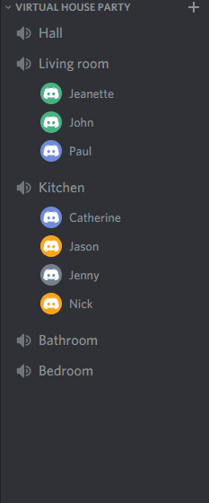

# PartyRoulette

PartyRoulette is a discord bot that enables members in a server to be assigned automatically to random voice channels in specified intervals. You can select how often members will be moved and how many members there should be in each voice channel. The bot can be used as a tool when hosting virtual parties on Discord to avoid crowded voice channels while still being able to interact with everyone at the party.

## Installation
  
Requires Node and NPM to be installed.

    git clone https://github.com/zaktaw/PartyRoulette.git  
    cd PartyRoulette  
    npm init  
    npm install  

## Setup

PartyRoulette is a self hosted bot, so you need to create a new application on Discord Developer Portal (https://discord.com/developers/) to obtain a token for the bot. 

### Edit config.json file

    config.json

    {  
        "token": "TOKEN",  
        "prefix": "pr ",  
        "categoryID": "CATEGORY ID",  
        "rouletteDuration": 900000,  
        "minGroupSize": 3,  
        "maxGroupSize": 5,  
        "announcementTimeLong": 180000,  
        "announcementTimeShort": 30000  
    }

1. token: Remove the TOKEN-placeholder and insert your actual token (keep the quotation marks).  

2. prefix: Choose your own prefix that the bot will respond to or use the default prefix.

3. categoryID: The bot will only move users to voice channels existing in a specific category / folder in the server (i.e "voice channels"). Go to your Discord server, copy the ID of your chosen category (Developer Mode needs to be enabled in Discord) and insert it.

4. rouletteDuration: The time that passes between each time the bot moves users to new channels. The time needs to be given in milliseconds. Default time is 900000 milliseconds = 15 minutes.

5. minGroupSize: the minimum number of members that will be assigned to each voice channel. If there aren't enough members to satisfy the minimum size in one group, the bot will move those members to other groups.

6. maxGroupSize: the maximum number of members that will be assigned to each voice channel. Note that the bot will prioritise to satisy the minimum size, which means that there will be some cases where the maximum limit is exceeded.

6. announcementTime: the bot sends two messages to everyone in the server when the channels are about to change. announcementTimeLong can be used to send an announcement long before changing channels and announcementTimeShort can be used to send an announcement shortly before changing. Time is given in milliseconds before channels are changing. Default time for long announcement is 180000 milliseconds = 3 minutes before channels are changing. Default time for short announcement is 30000 milliseconds = 30 seconds before changing channels. Note that the bot will output the time in minutes for long announcement and seconds for the short announcement. The announcments are disabled if time is set to 0.

### Add bot to server

To add the bot your server go to this site:

    https://discordapi.com/permissions.html

1. Choose to give the bot administrator permissions.  
2. Copy your clinet ID from Discord Developer Portal into the client ID field and click on the generated link beneath it.
3. Chose your server and authorize the bot.

The bot is now ready to be used!

## Usage

In a terminal navigate to the root folder and  start the bot with 

    node .

Go to your Discord server and start party roulette with

    pr start

To stop the roulette use

    pr stop
